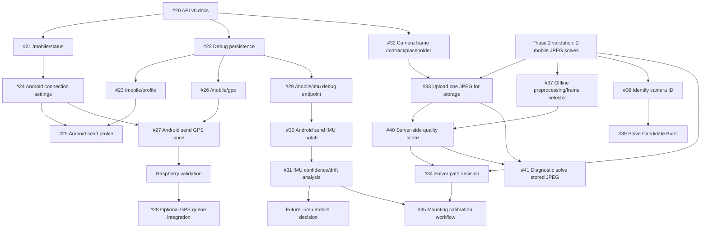

# Phase 4 Implementation Order And Dependency Map

Issue: [#36 Create Phase 4 implementation order and dependency map](https://github.com/oalexx/PiFinder_mobile_sensors/issues/36)

## Purpose

Phase 4 adds the Mobile Bridge between Android and PiFinder Lite. The goal is to
build the safe, observable pieces first and delay camera solving, IMU integrator
coupling, and telescope calibration until there is real validation data.

Classic PiFinder behavior must remain unchanged by default. Every Phase 4 item
should be additive, explicit, and easy to disable or ignore.

## Current Recommended Order

| Order | Issue | Status | Why Here |
| --- | --- | --- | --- |
| 1 | [#20 Mobile Bridge API v0 documentation](https://github.com/oalexx/PiFinder_mobile_sensors/issues/20) | Done | Defines the contract before implementation. |
| 2 | [#21 `/mobile/status`](https://github.com/oalexx/PiFinder_mobile_sensors/issues/21) | Done | Gives Android a low-risk connectivity check. |
| 3 | [#22 Persist mobile bridge data](https://github.com/oalexx/PiFinder_mobile_sensors/issues/22) | Done | Creates debug storage before accepting payloads. |
| 4 | [#23 `/mobile/profile`](https://github.com/oalexx/PiFinder_mobile_sensors/issues/23) | Done | Lets PiFinder receive Android capability data without changing runtime behavior. |
| 5 | [#24 Android connection settings + test connection](https://github.com/oalexx/PiFinder_mobile_sensors/issues/24) | Done | Gives Android one shared PiFinder base URL for WebView and bridge calls. |
| 6 | [#25 Send mobile profile from Android](https://github.com/oalexx/PiFinder_mobile_sensors/issues/25) | Done | Uses #23 and #24. Still debug-only. |
| 7 | [#26 `/mobile/gps`](https://github.com/oalexx/PiFinder_mobile_sensors/issues/26) | Done | Receives and persists a single GPS payload, but does not feed PiFinder GPS yet. |
| 8 | [#27 Send GPS once from Android](https://github.com/oalexx/PiFinder_mobile_sensors/issues/27) | Done | Uses #24 and #26. Still on-demand only. |
| 9 | Raspberry validation of #21-#27 | Validate on Raspberry | Confirms network, persistence paths, and phone-to-Pi behavior on real hardware. |
| 10 | [#28 Optional mobile GPS queue integration](https://github.com/oalexx/PiFinder_mobile_sensors/issues/28) | Validate first | Only after receive/persist works reliably on Raspberry. Must be behind explicit config. |
| 11 | [#29 `/mobile/imu`](https://github.com/oalexx/PiFinder_mobile_sensors/issues/29) | Done | Receives/persists IMU samples, no integrator coupling. |
| 12 | [#30 Send IMU batch from Android](https://github.com/oalexx/PiFinder_mobile_sensors/issues/30) | Done | Produces data needed by #31. |
| 13 | [#31 IMU confidence and drift investigation](https://github.com/oalexx/PiFinder_mobile_sensors/issues/31) | Analyze before integration | Gate for any future `--imu mobile` work. |
| 14 | [#32 Camera frame endpoint contract/placeholder](https://github.com/oalexx/PiFinder_mobile_sensors/issues/32) | Done | Contract and safe route were defined first; #33 supersedes the temporary `501` placeholder with storage-only upload. |
| 15 | [#33 Upload one mobile JPEG frame](https://github.com/oalexx/PiFinder_mobile_sensors/issues/33) | Done | Android can upload the latest Camera Lab JPEG and PiFinder stores it with metadata, without solving. |
| 16 | [#37 Offline preprocessing/frame selector](https://github.com/oalexx/PiFinder_mobile_sensors/issues/37) | Done | 30 ranked candidates tested with baseline/stretch/background-subtract variants; baseline solved best. |
| 17 | [#38 Identify recommended camera ID](https://github.com/oalexx/PiFinder_mobile_sensors/issues/38) | Done | Successful frames came from Samsung `SM-S948B` rear `cameraId=2`. |
| 18 | [#39 Solve Candidate Burst mode](https://github.com/oalexx/PiFinder_mobile_sensors/issues/39) | Done | Android Camera Lab now has a solve-targeted JPEG burst, initially using `cameraId=2` on `SM-S948B`. |
| 19 | [#40 Server-side image quality score](https://github.com/oalexx/PiFinder_mobile_sensors/issues/40) | Done | Offline/debug scorer grades stored JPEGs before diagnostic solving; no solver/runtime coupling. |
| 20 | [#34 Decide mobile camera solver path](https://github.com/oalexx/PiFinder_mobile_sensors/issues/34) | Done | Decision: `PROMISING_TUNE_FIRST`; continue diagnostic mobile-camera path, no live integration yet. |
| 21 | [#41 Diagnostic solve for stored mobile JPEGs](https://github.com/oalexx/PiFinder_mobile_sensors/issues/41) | Done | Quality-scored candidates can be solved diagnostically with structured results; no integrator/live pointing changes. |
| 22 | [#35 Mounting calibration workflow](https://github.com/oalexx/PiFinder_mobile_sensors/issues/35) | Design after IMU/camera evidence | Requires confidence in IMU and/or camera-assisted alignment. |

## Can Build Now

These are low-risk because they are additive and debug-oriented:

- [#32 Camera frame API contract](https://github.com/oalexx/PiFinder_mobile_sensors/issues/32), done: contract established
- [#33 Upload one mobile JPEG frame](https://github.com/oalexx/PiFinder_mobile_sensors/issues/33), done: storage-only upload
- [#37 Offline preprocessing/frame selector](https://github.com/oalexx/PiFinder_mobile_sensors/issues/37), done: analysis-only
- [#38 Identify recommended camera ID](https://github.com/oalexx/PiFinder_mobile_sensors/issues/38), done: `SM-S948B` should try rear `cameraId=2` first

Build rule:

Do not let these change PiFinder's live location, pointing, solving, camera, or
integrator state unless a later issue explicitly enables that behavior behind a
flag or config option.

## Validate On Raspberry

These need real Raspberry/PiFinder hardware or phone-on-same-network validation:

- `/mobile/status` from Android using the real PiFinder IP or `pifinder.local`.
- `/mobile/profile` persistence under `~/PiFinder_data/mobile/profile_latest.json`.
- `/mobile/gps` persistence under `~/PiFinder_data/mobile/gps_latest.json`.
- Android `Test Connection`, `Send Profile`, and `Send GPS`.
- Whether mDNS `pifinder.local` resolves reliably from Android.
- Whether file permissions and paths match the real Pi user environment.

Suggested Raspberry validation order:

1. Start PiFinder Lite/headless.
2. Open Android app on the same Wi-Fi.
3. Tap `Test Connection`.
4. Send profile.
5. Send one GPS fix.
6. Confirm JSON files exist under `~/PiFinder_data/mobile/`.
7. Restart PiFinder and repeat once.

## Blocked Or Deferred

### Camera / Solver

Phase 2 night-sky validation is partially complete:

- `Test cam/` contained 308 JPG frames.
- Tetra3 solved 2 Camera Sweep ISO 3200 frames from block `4`.
- Decision: continue mobile camera work, but tune capture before live solver
  integration.

Unblocked now:

- [#38 Identify recommended camera ID](https://github.com/oalexx/PiFinder_mobile_sensors/issues/38).

Still deferred:

- Live PiFinder solver/integrator coupling for mobile frames.
- Automatic solve on every uploaded mobile frame.
- RAW-first processing.

Required first:

- Store JPEG + metadata.
- Score frame quality.
- Confirm camera ID and repeat clear/fixed-mount tests.
- Add diagnostic solve only after storage and quality scoring.

### IMU / Integrator

Blocked by recorded sample analysis:

- Any future `--imu mobile`.
- Any mobile IMU data feeding PiFinder's integrator.
- Any confidence filter that affects pointing state.

Required first:

- Persist bounded IMU sample batches.
- Compare rotation vector vs game rotation vector.
- Check stationary drift, movement jumps, timestamp quality, and magnetic
  contamination.
- Write the #31 recommendation.

### Calibration

[#35 Mounting calibration workflow](https://github.com/oalexx/PiFinder_mobile_sensors/issues/35) should remain design-first until there is evidence for:

- usable phone orientation data, or
- usable mobile camera frame solving, or
- a manual target workflow that is valuable without either.

## Dependency Graph

## Guardrails For Upstream Merge

- Keep new endpoints under `/mobile/...`.
- Keep Android bridge calls explicit and user-triggered at first.
- Persist debug payloads, but do not silently apply them to PiFinder state.
- Add flags/config before any mobile GPS or IMU data affects live behavior.
- Document every original PiFinder code change in
  `PiFinder_lite/documentation/upstream_change_log.md`.
- Prefer small endpoint/helper changes over rewiring existing processes.

## Next Best Issue

After completing [#38](https://github.com/oalexx/PiFinder_mobile_sensors/issues/38),
the next best camera issues are:

1. Raspberry/device validation of stored uploads, scoring output, and diagnostic solves.
2. Repeat clear-sky/fixed-mount capture to refine recommended phone config.
3. Build a guided diagnostic workflow around capture -> upload -> score -> solve.

The next best bridge/hardware issue remains Raspberry/device validation of
#21-#30. After real IMU batches are captured, [#31 IMU confidence and drift
investigation](https://github.com/oalexx/PiFinder_mobile_sensors/issues/31)
becomes the next IMU gate.
